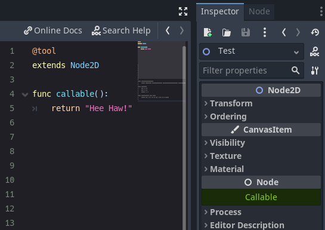
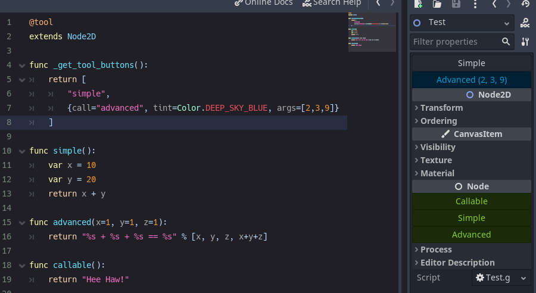

## ToolButtonPlugin for Godot 4.0 - v1.1

Editor buttons with one line of code: `@tool`.



## Getting Started

- Enable plugin.
- Add `@tool` to top of your script.
- Buttons will be at the bottom of the inspector.

## Advanced Example

To specify buttons that show above the inspector, add a `_get_tool_buttons` func.



With `Strings`:
```gd
@tool
extends Node

func _get_tool_buttons():
	return ["boost_score", "remove_player"]

func boost_score():
	Player.score += 100

func remove_player():
	Player.queue_free()
```
and/or `Lambdas`

```gd
# WARNING, some stuff won't work: If you get *"Cannot access member without instance"*: https://github.com/godotengine/godot/issues/56780
@tool
extends Node

func _get_tool_buttons():
	return [
		func add_score(): score += 10,
		func reset_health(): health = 0
	]
```
and/or `Dictionarys`
```gd
@tool
extends Node

signal reset()

func _get_tool_buttons(): return [
	"boost_score",
	{call="boost_score", args=[100], tint=Color.DEEP_SKY_BLUE},
	{call="emit_signal", args=["reset"], text="Reset", tint=Color.TOMATO},
	{
		call=func(): print("My Health: ", health),
		text="Print Health",
		tint=func(): return Color(health * .1, 0.0, 0.0)
		lock=func(): return health == 100
	}
]

func boost_score(x=10):
	Player.score += x
```

`call` is mandatory. Other's are optional.

|key    |desc                           |default              |
|:------|:------------------------------|:--------------------|
|call   | Method to call.               | - |
|args   | Array of arguments to pass.<br>*(Mouse over button to see args.)*   | - |
|text   | Button label.                 | - |
|tint   | Button color.                 | Color.WHITE |
|icon   | Button icon.                  | -
|flat   | Button is flat style.         | false |
|hint   | Hint text for mouse over.     | - |
|print  | Print output of method call?  | true |
|align  | Button alignment.             | BoxContainer.ALIGNMENT_CENTER |
|lock   | Disable button?               | false |
|update_filesystem| Tells Godot editor to rescan file system. | false |


## Resource Example

For `_get_tool_buttons` to work on a `Resource` it needs to be static.

```gd
@tool
extends Resource
class_name MyResource

# STATIC
static func _get_tool_buttons():
	return ["my_button"]

# LOCAL
export(String) var my_name:String = ""

func my_button():
	print(my_name)
```

# Changes
## 1.1
- Updated for Godot `4.0.alpha2`
- Added lambda support `call` `text` `icon` `tint` `lock`: `{ text="Lambda", call=func(): print("From lambda with love") }`
- Changed `disabled` to `lock`
- Bottom buttons are alphabetically sorted.


